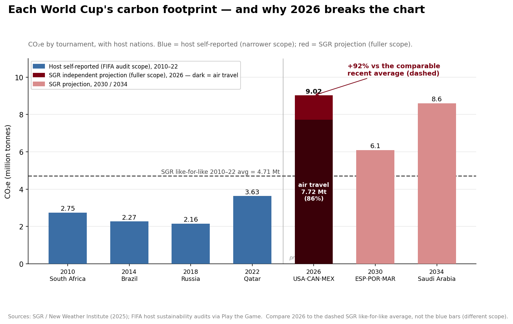

# FIFA World Cup Carbon Footprint per Edition (2010–2034)

Greenhouse-gas footprint of each FIFA men's World Cup, one row per tournament, with the
air-travel share broken out. The expanded, three-nation **2026** tournament is projected to be
the **most polluting ever (~9.0 Mt CO2e), ~86% of it from air travel.**

## Data

### `emissions_per_edition.csv`
One row per tournament (2010, 2014, 2018, 2022, 2026, 2030, 2034).

| field | type | description |
|-------|------|-------------|
| year | integer | edition year |
| host | string | host nation(s) |
| co2e_mt | number | total emissions, million tonnes CO2e |
| basis | string | `FIFA self-report` (2010–22, narrower scope) or `SGR projection` (2026–34, fuller scope) |
| source / source_url | string | citation + link |

### `emissions_reference.csv`
SGR's recalculated 2010–22 average (like-for-like with the projection) and the 2026 air-travel split.

## ⚠️ Methodology — read before comparing
The 2010–2022 rows are **FIFA self-reported** audits (2.2–3.6 Mt) on a **narrower** boundary than
the **SGR** projection for 2026+. Do **not** compare the SGR 2026 figure directly to the FIFA
self-reports. The honest, like-for-like comparison is **2026 (9.02 Mt) vs SGR's recalculated
2010–22 average (4.71 Mt) = +92%** (the recalculated average is in `emissions_reference.csv`).
2026/2030/2034 are **projections**, not actuals.

## Sources
- SGR / New Weather Institute, *FIFA's Climate Blind Spot: The Men's World Cup in a Warming World* (2025) — figures from Table ES-1.
- FIFA host sustainability audits, via Play the Game.

## License
Figures are factual and reusable **with attribution** to the sources above.

## Story

**Each World Cup's carbon footprint — and why 2026 breaks the chart**

> 9.0 Mt CO₂e (+92%); 86% air travel

Full narrative — headline, why-now, caveats, provenance, and ready-to-post copy — in [`STORY.md`](STORY.md). This data story was fact-checked by an adversarial review pass (figures recomputed against primary sources) before release.
